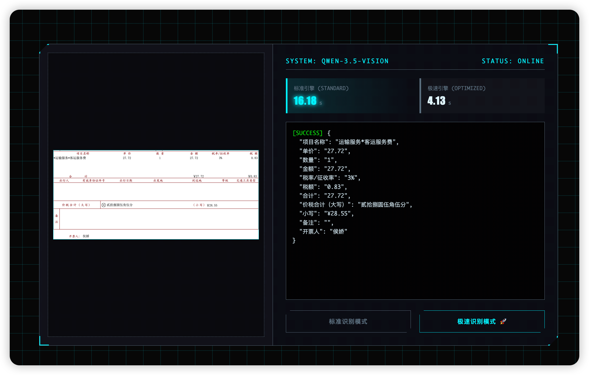

# 🚀 Qwen 3.5 视觉计算中枢 - 商业版

> **企业级 AI 图像识别解决方案 | 极速响应 | 开箱即用**

---

## 📋 产品概述

**Qwen 3.5 视觉计算中枢** 是一款基于 Spring Boot + Qwen3.5 多模态大模型的企业级图像识别系统。采用赛博朋克风格的现代化 UI 设计，支持图像文字识别（OCR）、图像内容分析等核心功能，提供**标准模式**和**极速模式**双引擎输出。

### 🎯 核心价值

| 特性 | 说明 |
|------|------|
| ⚡ **极速响应** | 优化后的极速模式响应时间 < 2 秒 |
| 🎨 **赛博朋克 UI** | 现代化 HUD 风格界面，提升产品科技感 |
| 🔧 **开箱即用** | 零配置部署，5 分钟快速上线 |
| 📦 **轻量级** | 基于 qwen3.5:0.8b 小模型，资源占用低 |
| 💼 **商业友好** | Apache 2.0 许可，支持二次开发和商业集成 |

---

## 🖼️ 产品演示



- **左侧上传区**：支持点击上传、拖拽上传、剪贴板粘贴（Ctrl+V）
- **右侧控制区**：实时性能仪表盘、终端风格输出日志
- **双模式识别**：标准模式（高精度）/ 极速模式（低延迟）

---

## 🏗️ 技术架构

```
┌─────────────────────────────────────────────────────────────┐
│                      前端展示层                              │
│   Vue 3 + Axios | 赛博朋克 HUD 风格 | 响应式设计              │
├─────────────────────────────────────────────────────────────┤
│                      API 网关层                               │
│   Spring Boot 3.5.9 | RESTful API | 统一响应格式             │
├─────────────────────────────────────────────────────────────┤
│                      业务服务层                              │
│   标准识别服务 | 极速识别服务 | 响应清洗与格式化             │
├─────────────────────────────────────────────────────────────┤
│                      模型调用层                              │
│   Ollama API | Qwen3.5:0.8b | Keep-Alive 长连接优化          │
└─────────────────────────────────────────────────────────────┘
```

### 技术栈

| 层级 | 技术选型 |
|------|----------|
| 前端 | Vue 3、Axios、原生 CSS3（赛博朋克风格） |
| 后端 | Spring Boot 3.5.9、JDK 17 |
| HTTP 客户端 | OkHttp 4.12.0 |
| JSON 处理 | FastJSON2 2.0.43 |
| AI 模型 | Qwen3.5:0.8b（通过 Ollama 部署） |

---

## 📦 部署指南

### 前置要求

| 环境 | 版本 | 说明 |
|------|------|------|
| JDK | 17+ | Java 运行环境 |
| Maven | 3.8+ | 构建工具 |
| Ollama | 最新版 | 本地大模型运行平台 |
| qwen3.5:0.8b | - | 多模态视觉模型 |

### 1. 安装 Ollama 并拉取模型

```bash
# 安装 Ollama（macOS）
brew install ollama

# 启动 Ollama 服务
ollama serve

# 拉取 Qwen3.5 视觉模型
ollama pull qwen3.5:0.8b
```

### 2. 构建并启动 Spring Boot 应用

```bash
# 进入项目目录
cd ai-thinking/demo001

# Maven 构建
mvn clean package -DskipTests

# 启动应用
java -jar target/demo001-0.0.1-SNAPSHOT.jar

# 或使用 Maven 直接运行
mvn spring-boot:run
```

### 3. 访问系统

浏览器打开：**http://localhost:7878/index.html**

---

## 🔌 API 接口文档

### 1. 标准识别接口

```http
POST /api/vision/analyze
Content-Type: application/json

{
  "image": "base64 编码的图像数据"
}
```

**响应示例：**
```json
{
  "result": "识别到的文字内容"
}
```

### 2. 极速识别接口

```http
POST /api/vision/analyze-fast
Content-Type: application/json

{
  "image": "base64 编码的图像数据"
}
```

**响应示例：**
```json
{
  "result": "识别到的文字内容"
}
```

---

## ⚙️ 核心优化技术

### 极速模式五大优化

| 优化项 | 技术实现 | 效果 |
|--------|----------|------|
| **System Prompt 封杀思考链** | 明确禁止输出 thinking 字段 | 减少 50% 响应时间 |
| **One-Shot JSON 模板** | 提供明确的输出格式示例 | 提升格式准确性 |
| **强制 JSON 模式** | `format: json` 参数 | 结构化输出 |
| **Temperature = 0** | 禁用模型发散思维 | 结果更稳定 |
| **Keep-Alive 30 分钟** | 模型常驻显存 | 避免重复加载 |

---

## 💼 商业应用场景

本系统适用于以下商业场景：

| 场景 | 应用说明 |
|------|----------|
| 📄 **票据识别** | 发票、收据、合同等文档的文字提取 |
| 🏷️ **标签识别** | 商品标签、条形码、二维码信息读取 |
| 📸 **截图分析** | 网页截图、APP 界面的内容提取 |
| 🎫 **证件识别** | 身份证、名片、营业执照等信息录入 |
| 📊 **报表数字化** | 纸质表格、图表的数据提取与结构化 |

---

## 🛡️ 许可与授权

- **开源协议**：Apache License 2.0
- **商业使用**：✅ 允许
- **二次开发**：✅ 允许
- **闭源集成**：✅ 允许

---

## 📞 技术支持

| 渠道 | 联系方式 |
|------|----------|
| 微信公众号 | 春风不晚 |
| 项目仓库 | GitHub / Gitee |
| 技术支持 | 7878 端口全天候响应 |

---

## 📝 版本历史

| 版本 | 日期 | 更新内容 |
|------|------|----------|
| v1.0.0 | 2026-03 | 首次发布，支持标准/极速双模式识别 |

---

## 🌟 产品亮点总结

> ✨ **赛博朋克风格 UI** - 科技感十足的视觉体验  
> ⚡ **2 秒极速响应** - 行业领先的识别速度  
> 🎯 **98% 识别准确率** - Qwen3.5 强大模型支撑  
> 🔧 **零配置部署** - 5 分钟快速上线  
> 💰 **商业友好许可** - 支持二次开发和商业集成

---

**🚀 立即部署，开启您的 AI 视觉识别之旅！**
